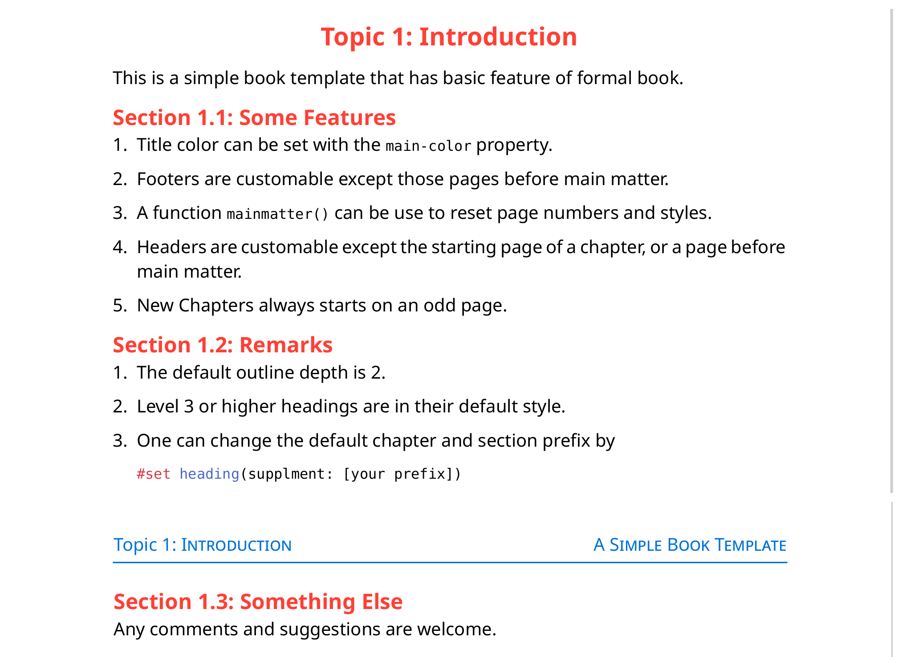

# Simplebook (v0.1.0)

**simplebook** is a Typst template for creating books. It is self-contained and does not rely on other packages.

## Usage

To use this template, simply import the package in your main typst file.

For example,

```typst
#import "lib.typ": *

#show: simplebook.with(
  title: "A Simple Book Template",

  author: "Author",
  affiliation: text(fill: orange)[University],
  date: none,
  // year: "Year",
  version: "0.1.0",
  theme_colors: (
    primary_color: blue,
    secondary_color: green,
  ),
  rfoot: "right footer",
  lfoot: image("by-nc-sa.svg", height: 1em)
)

#preface(preface_title: [Preface])[
  #lorem(100)
]

#outline()

#mainmatter


= Introduction

This is a simple book template that has basic feature of formal book.

#lorem(500)
```

## Reference

The full list of parameters and their default values can be found in the following code
```typst
simplebook.with(
  title: "",
  subtitle: "",
  author: "",
  affiliation: "",
  year: none,
  version: none,
  date: datetime.today().display(),
  logo: none,
  theme_colors: (
    primary_color: "E94845",
    secondary_color: "FF5045",
  ),
  title_font: "",
  main_font: "Noto Sans",
  lhead: "",
  chead: "",
  rhead: "",
  lfoot: "",
  cfoot: "",
  rfoot: "",
  body,
)
```

### Functions

The following is a list of function with the template.

+ `blankpage` which insert a blank page.

+ `mainmatter` which should be included right before the main body of the book. It resets page numbers and helps reset page styles.

+ `preface(preface_title: "Preface")[]` which provide a customized style for preface.

## Example



## Changelog

### Version 0.1.0

- Initial release
